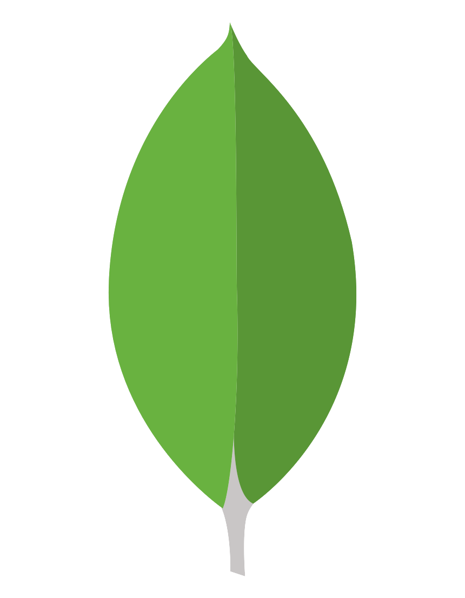

<h1 align="center"> Hi, I'm James</h1>
<p align="center">
<a href="https://jamesmidzi.netlify.app/"></a>&nbsp;
<a href="https://www.linkedin.com/in/jamesmidzi/"></a>&nbsp;
<a href="https://twitter.com/Psypher1"></a>&nbsp;
<a href="https://hashnode.com/@Psypher1"></a>&nbsp;
<a href="https://mydialectics.wordpress.com"></a>&nbsp;

</p>

---

<h3  align="center">I love languages. Put simply; J'aime les langues; Я люблю языки.</h3>

<br />
For me, each day is an opportunity to learn and try to be better than I was yesterday.
I believe knowledge is meant to be shared - I aim to do that wherever I can.
<br/>
<h3 align='center'> I learn, I develop, I write, I tutor...</h3>

- I am currently a member of the [TYPO3](https://typo3.org/) Mentorship program
- I am deciding which Headless CMS to use for my next projects.
- I am working towards inner peace 🐼
- **Fun Fact**: I adore penguins 🐧

<br/>

Collaboration is key - if you have anything you may want help with or anything you think I might find interesting, please feel free to hit me up: [Email me](jamesmidzi@gmail.com)

<!-- #### Connect with me:

[Twitter](https://twitter.com/Psypher1) | [LinkedIn](https://www.linkedin.com/in/jamesmidzi/) | [Email](jamesmidzi@gmail.com) -->

<br/>

### What I Enjoy Doing:

**Taming snakes**

```py
def greet():
    print("Hello there")

greet()
```

**Talking to APIs**

```js
async function getServerSideProps(){
    const res = await fetch(process.env.API_URL);
    const data = await res.json();

    return {
        props{
            data;
          }
       }
    }
```

**Creating cool things with the stacks I know**

```py

django-admin startproject my-new-site

```

```js
npx create-next-app my-site
```

<br/>
<h3 align="center">Tools & Stacks</h3>

<p align="center">


</p>

<p align="center">





</p>

<p align="center">


</p>

<hr/>

<h1 align="center">I HAVE FUN!!!😄</h1>

> **À Petits Pas, J'irai Très Loin - With Small Steps, I Will Go Very Far**

---

### 📖 My Latest Articles

<!-- BLOG-POST-LIST:START -->
<<<<<<< HEAD

=======
- [T3MP Session Eight: Site Package Customisation](https://dantedecodes.hashnode.dev/t3mp-session-eight-site-package-customisation)
- [You Don&#39;t Have To Learn Everything](https://dantedecodes.hashnode.dev/you-dont-have-to-learn-everything)
>>>>>>> 6490e47239a8e4fa8260123c4738e4763d68e30a
- [T3MP Session Seven: Multilanguage Features](https://dantedecodes.hashnode.dev/t3mp-session-seven-multilanguage-features)
- [Finding A CMS](https://dantedecodes.hashnode.dev/finding-a-cms)
- [T3MP Session Six: User Access](https://dantedecodes.hashnode.dev/t3mp-session-six-user-access)
<!-- BLOG-POST-LIST:END -->

<!--
**Psypher1/Psypher1** is a ✨ _special_ ✨ repository because its `README.md` (this file) appears on your GitHub profile.

Here are some ideas to get you started:

- 🔭 I’m currently working on ...
- 🌱 I’m currently learning ...
- 👯 I’m looking to collaborate on ...
- 🤔 I’m looking for help with ...
- 💬 Ask me about ...
- 📫 How to reach me: ...
- 😄 Pronouns: ...
- ⚡ Fun fact: ...
-->
